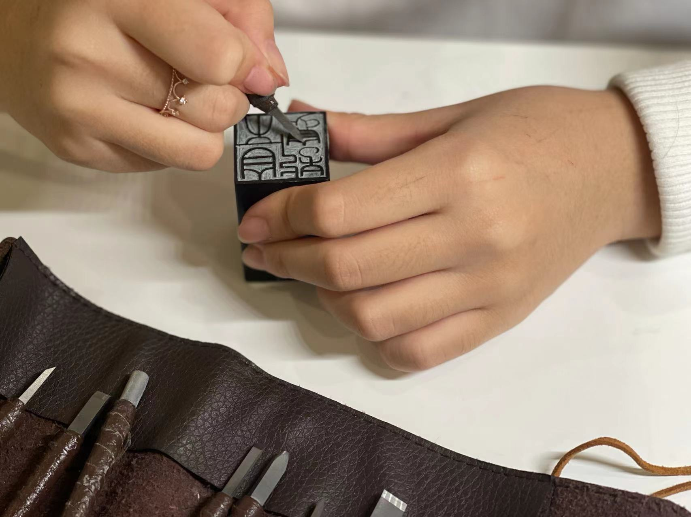
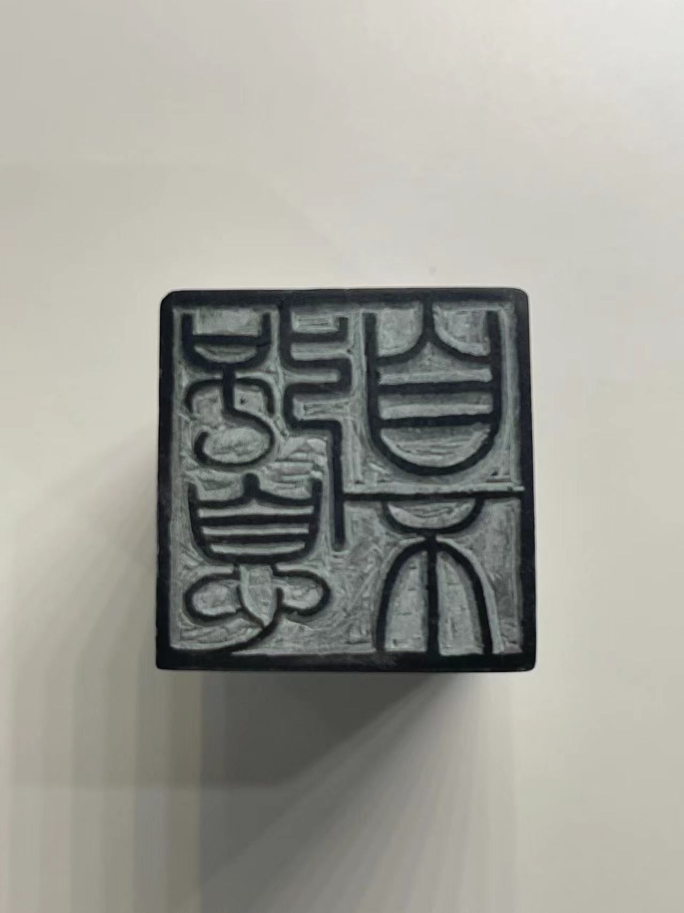
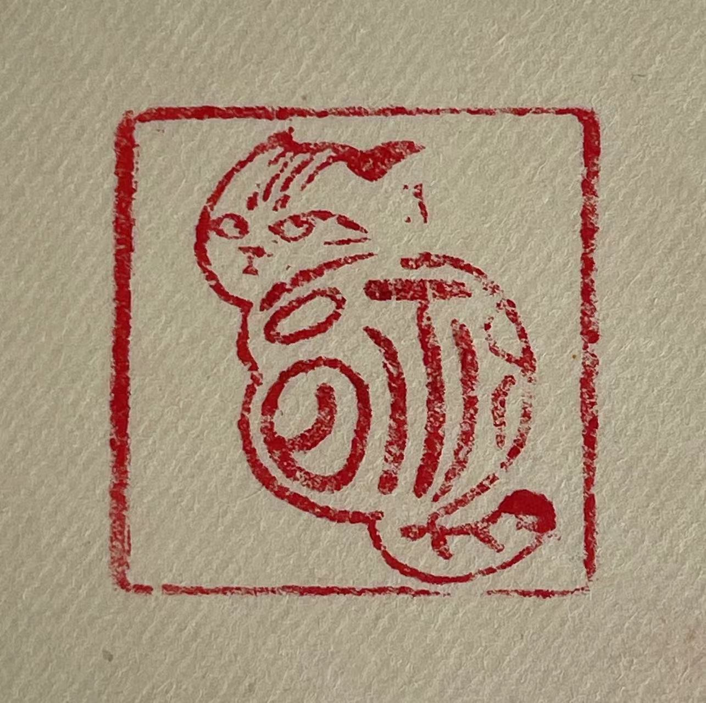
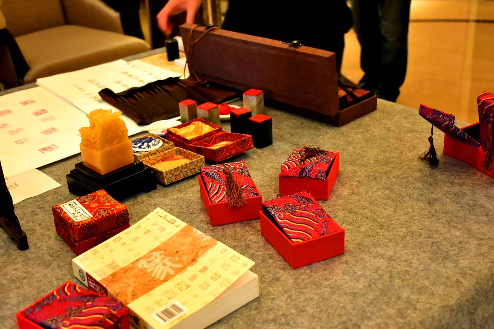
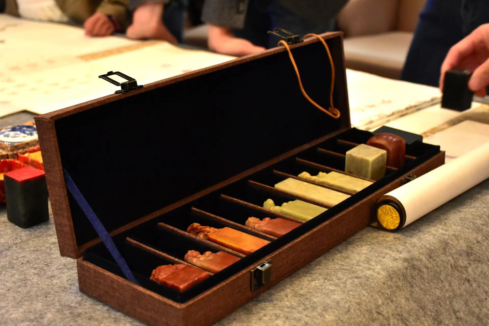
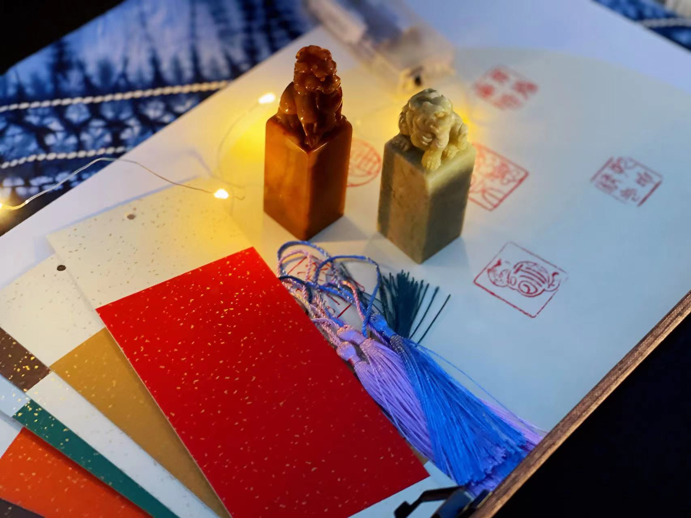
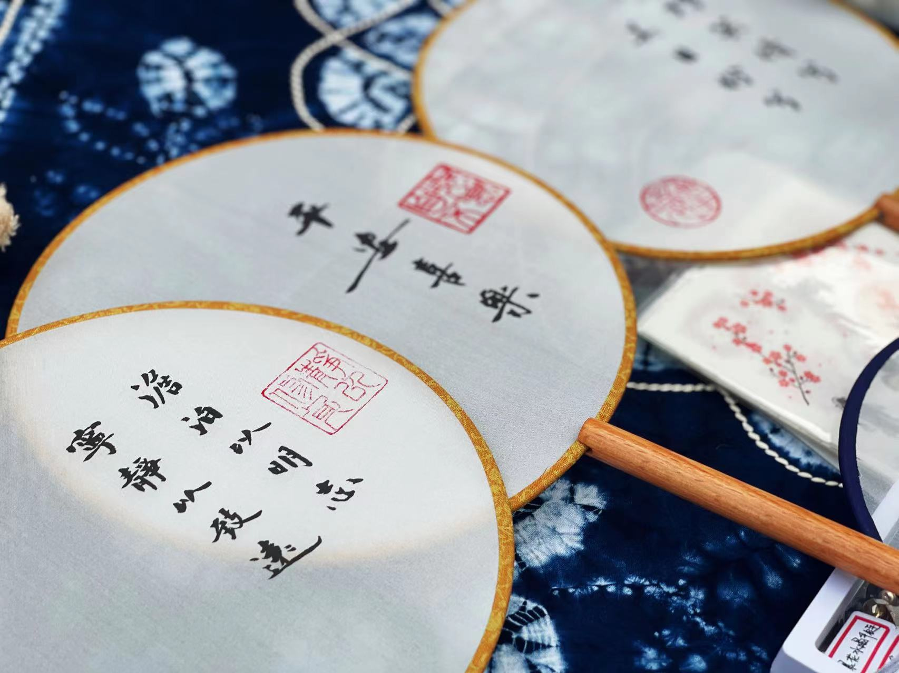

# 匠心匠韵社

择一事，终一生, 不为繁华易匠心。

大家好，我们是“**匠心匠韵**”社团，致力于人类非物质文化遗产-篆刻印章及剪纸等技艺的传承与创新实践。

在每周的活动中，我们有体系化、互动讨论式的学习课件，也有生动有趣的动手实践。我们会在一次次的思想碰撞中凝视过往，感受传统技艺的韵味与魅力。

我们选择做传统技艺的传承与创新，这是一件非常有趣、有情、有料地一件事。对于每件作品的创作，在沉浸于古典艺术之美的同时，融入现代的元素及对生活的思考，来表达我们新的想法。

我们将会讨论Kara Walker等艺术家，他们将传统文化和现代艺术相结合，做出了不一样的作品和全新的表达。我们也有机会举办作品艺术沙龙、爱心公益、艺术中心探究等活动。

欢迎感兴趣的同学加入，与我们一起传承匠心精神，为生活增添一抹独具特色的韵味。

<figure><figcaption></figcaption></figure>

<figure><figcaption></figcaption></figure>

<figure><figcaption></figcaption></figure>

<figure><figcaption></figcaption></figure>

<figure><figcaption></figcaption></figure>

<figure><figcaption></figcaption></figure>

<figure><figcaption></figcaption></figure>

<figure><figcaption></figcaption></figure>

<figure><figcaption></figcaption></figure>
