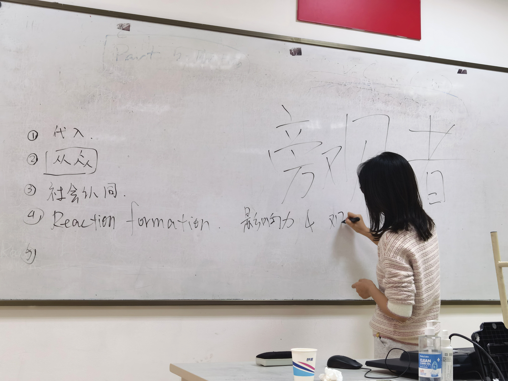
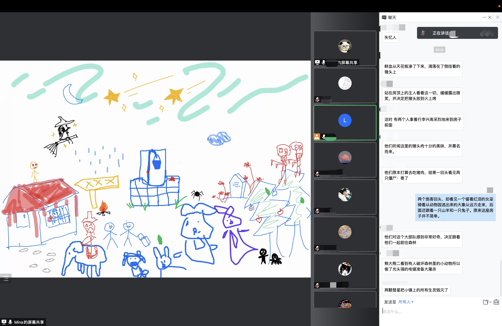
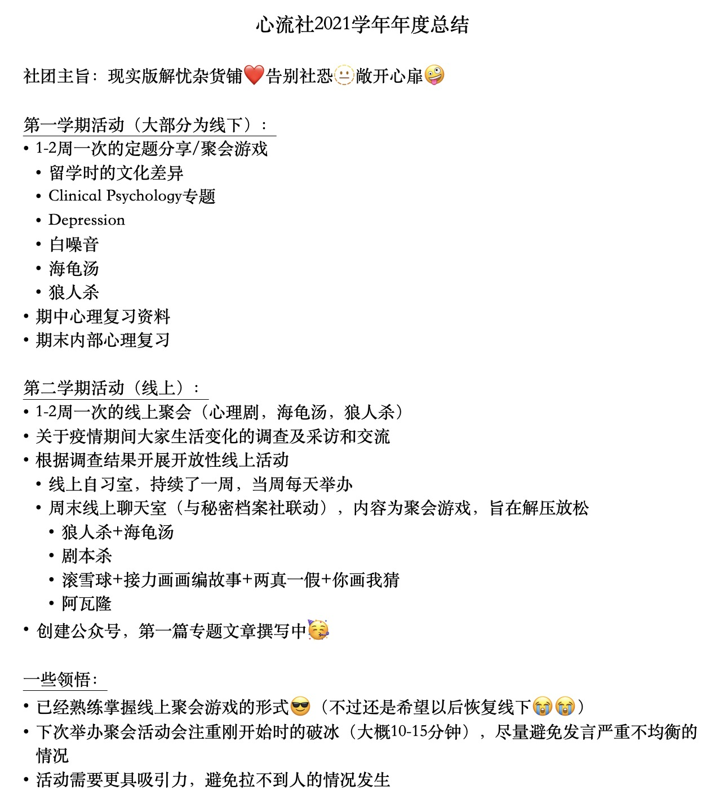

# 心流社

HELLOOOO！这里是心流社～

我们的主旨是：**建立现实版解忧杂货铺️；告别社恐；敞开心扉🤪**

在这里，线上游戏聚会，线下分享心理知识，日常聊天，复习论坛……应有尽有！

<figure><figcaption>
线下分享
</figcaption></figure>

<figure><figcaption>
线上聚会
</figcaption></figure>

具体可见2021年年度总结👀

<figure><figcaption></figcaption></figure>

此外，我们的社团公众号_**欲语心流Excape**_，内容正在撰写中！

以下是我们对2022学年的企划：

* 充分利用社团邮箱
* 公众号（分为三大板块：解压方法，治愈系文案，心理专题）
* 1-2周一次的聚会小活动（类似上个学年的内容，可以加上比如冥想等更多样化的体验）
* 每个月举办一次开放性线下论坛，像节目一样用聊天/抽卡片/游戏的方式探讨话题
* 国庆节左右会发布一个帮助青少年缓解压力的APP（安卓和ios系统都有），针对APP内容进行一些活动（比如采访，做线上提问箱等）
* 心理复习会/复习资料
* 做一些线下的志愿活动，比如去自闭症儿童咖啡馆
* 专家讲座

欢迎加入🥳！可加此微信联系我们👀

<figure><figcaption></figcaption></figure>
