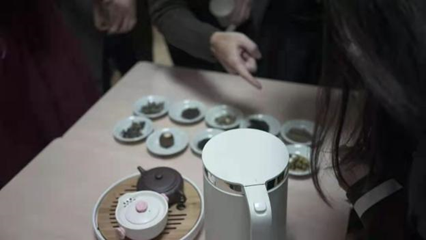

# 星有灵犀社

“身无彩凤双飞翼，心有灵犀一点通。”

我们是**星有灵犀**，致力于弘扬**中国传统文学与文化**（亦欢迎西方文学爱好者前来互相切磋）。作为一个拥有**五年历史**的老牌社团，我们对传统文化的热爱一直传承延续下来。

每年，我们定期举办校级的**诗词大会**，给予诗词爱好者一个切磋、展示自己的品台，也让更多的人感受到古诗词的美。

.png>)

<figure><figcaption></figcaption></figure>

.png>)

我们也举办过其他精彩的活动，比如茶馆、诗歌征稿、Carnival摆摊等……我们愿以多元的方式，让更多的人了解中国文化与文学。

.png>)

.png>)

在社团内部，我们每周定期活动，讨论古今中外的文学与文化，从诸子百家到日本神话，从周易算卦到当代诗歌……在不断的讨论、碰撞下，我们的思维更加复杂、深刻，也与彼此心有灵犀。“腹有诗书气自华”，我们由此成就更好的自己。

.png>)

我们的故事还在继续啦，会持续在**公众号“SSBS 心有灵犀”**发布！欢迎关注！

.png>)

“来者乐其所安而得其所乐，适其所适而无所忧。星者，性也，和于情而忘形。有者，游也，适朝彻不知其所止。灵者，神也，妙万物而应气韵于笔端。犀者，息也，虚灵府而闻天籁之不绝。”

**而相信，心有灵犀的我们，终将相遇。**

